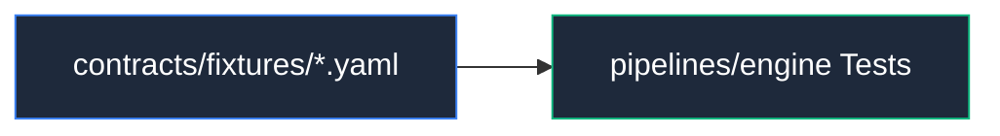

# 🧪 Test Fixtures & Configurations

Dumps de configuración YAML y casos de prueba sintéticos para validación de pipelines WPipe.

```mermaid
flowchart LR
    Fixtures["contracts/fixtures/*.yaml"] --> Engine["pipelines/engine Tests"]

    style Fixtures fill:#1e293b,color:#fff,stroke:#3b82f6
    style Engine fill:#1e293b,color:#fff,stroke:#10b981
```
