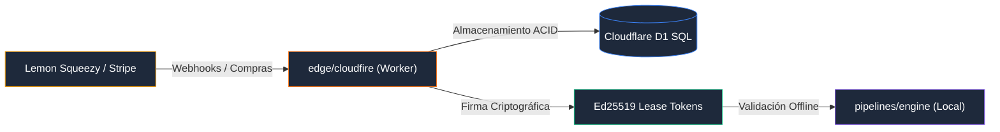

# ⚡ Edge Serverless Computing — Cloudflare

Servicios distribuidos y API de licenciamiento serverless alojados en la red global de Cloudflare a **0 €/mes**.

## 📌 Arquitectura & Flujo

```mermaid
flowchart LR
    Lemon["Lemon Squeezy / Stripe"] -->|Webhooks / Compras| Worker["edge/cloudfire (Worker)"]
    Worker -->|Almacenamiento ACID| D1[("Cloudflare D1 SQL")]
    Worker -->|Firma Criptográfica| Ed25519["Ed25519 Lease Tokens"]
    Ed25519 -->|Validación Offline| Engine["pipelines/engine (Local)"]

    style Lemon fill:#1e293b,color:#fff,stroke:#f59e0b
    style Worker fill:#1e293b,color:#fff,stroke:#f97316
    style D1 fill:#1e293b,color:#fff,stroke:#3b82f6
    style Ed25519 fill:#1e293b,color:#fff,stroke:#10b981
    style Engine fill:#1e293b,color:#fff,stroke:#8b5cf6
```
