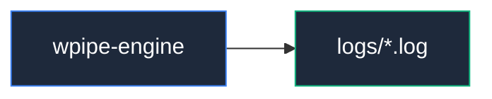

# 📝 Engine Runtime Logs

Archivos de registro y trazas de ejecución del daemon local.

```mermaid
flowchart LR
    Daemon["wpipe-engine"] --> Log["logs/*.log"]
    style Daemon fill:#1e293b,color:#fff,stroke:#3b82f6
    style Log fill:#1e293b,color:#fff,stroke:#10b981
```
