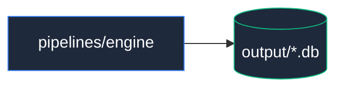

# 📦 Engine Output Artifacts

Bases de datos temporales y volcados generados por el motor local `wpipe-engine`.

```mermaid
flowchart LR
    Engine["pipelines/engine"] --> DB[("output/*.db")]
    style Engine fill:#1e293b,color:#fff,stroke:#3b82f6
    style DB fill:#1e293b,color:#fff,stroke:#10b981
```
