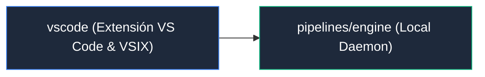

# 🧩 IDE Extensions — WPipe Studio

Extensiones nativas para entornos de desarrollo.

```mermaid
flowchart LR
    VSCode["vscode (Extensión VS Code & VSIX)"] --> Daemon["pipelines/engine (Local Daemon)"]
    style VSCode fill:#1e293b,color:#fff,stroke:#3b82f6
    style Daemon fill:#1e293b,color:#fff,stroke:#10b981
```
